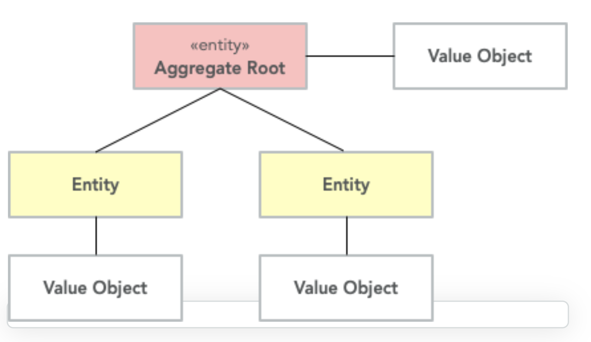

# tactical-domain-driven-design

- 전략적(strategic) 디자인은 추상적인 전체를 다루는 반면 전술적(tactical) 디자인은 클래스와 모듈을 다룬다
- 전술적 설계의 목적은 도메인 모델을 실제 코드로 구체화하는 것
- 전략적 설계를 마친 다음, 전술적 설계로 코드를 구체화시키면서 문제가 생기면 다시 전략적 설계를 보완하는 반복적인 단계를 진행한다

## tactical design 을 위한 도구들

 - Value Objects(VO)
    - 두개의 VO 내에 있는 값들이 같다면 두개의 VO는 같은 VO로 간주된다
    - immutable 로 만들어야 한다 (VO의 상태를 변경하지 않고 새로운 VO를 만든다)
    - VO 내에는 단순히 값들이 아닌 business logic도 포함할 수 있다
        - VO가 immutable 이기 때문에 business logic은 thread-safe 하다
        - 이러한 이유 때문에 domain에 VO가 많을수록 좋다
    - 가급적 VO 의 size 를 작고 응집도가 높게 유지하는 것이 좋다
        - 유지보수와 재사용이 쉽다
    - VO를 만들기 위해서 business 의미를 가지는 여러개의 값들을 래핑해 하나의 객체로 만든다
        - ex. BigDecimal 대신에 BigDecimal을 포함하는 Money VO
        - ex. phone number 를 string 으로 표현하기보다 string을 포함하는 PhoneNumber VO
    - 장점 
        - 값에 명확한 의미가 부여된다
        - 값에 대해 business operation 을 추가할 수 있다
        - 값에 대한 검증(ex. null check)을 VO 생성자에서 할 수 있다         
 - Entities
    - 고유의 ID 를 가지는 객체(Entity의 수명주기 동안 ID는 변하지 않는다)
    - 객체 내의 값이 달라도 ID가 같으면 같은 entity로 간주된다
    - 객체 내의 값이 같아도 ID가 다르면 다른 entity로 간주된다
    - VO 와 다르게 mutable 하다
        - 값을 변경할때, setter 를 사용할 수도 있고 왜 값이 변경되어야 하는지에 대한 이유를 나타내는
         값 변경 메소드를 만들 수도 있다       
            - ex. setEndDate(finalDay) 대신 terminateContract(reason, finalDay)
        - setFirstName(..) , setLastName(..) 대신 changeName(firstName, lastName, reason, effectiveAsOfDate)     
 
 - Entity or Value Object?
    - 같은 개념이 상황에 따라 Entity가 될수도 있고 VO 가 될수도 있다
    - VO 가 immutable 하고 사이즈가 더 작기 때문에 entity를 가능한 적게, VO를 가능한 많이 유지하는 것이 좋다
 
 - Aggregates
    - 다음과 같은 특성을 가지고 있는 entity 와 VO 의 집합
        - create, retrieve, store 가 통째로 이루어진다
        - 항상 일관된 상태를 유지한다               
        - aggregate root 가 하나의 aggregate 를 소유하며, aggregate 에는 자신을 식별하는 ID 가 있다
        - 
        
    - aggregate 는 아래와 같은 조건을 만족시켜야 한다
        - 바깥에서 참조되는 aggregate 는 반드시 aggregate root 를 통해 참조되어야 한다
        - aggregate root 는 aggregate 의 비즈니스 일관성을 유지해야 한다
        - 
        
    - entity 를 aggregate root 로 사용할 것이지 , aggregate root 아래에 둘 것인지(local entity) 결정해야 한다
        - local entity 는 다른 aggregate 에서 참조될 수 없기 때문에, aggregate 내에서만 고유한 ID를 사용하면 된다
        - aggregate root 로 사용되는 entity 는 외부에서 참조될 수 있기 때문에 global unique 한 ID를 사용해야 한다      
    
    - entity 를 aggregate root로 사용할지 아닐지를 어떤 기준에서 판단할까?
        - entity 가 application 내에서 어떻게 접근되는가?
        - entity 가 ID 로 검색된다면 aggregate root 이다
        - 다른 aggregate 에서 이 entity를 참조해야 한다면 aggregate root 이다
        - application 에서 entity가 어떻게 변형되는가?
            - 독립적으로 entity 가 변경된다면 aggregate root
            - 다른 entity 가 변경되어야 이 entity가 변경된다면 이 entity 는 local entity
            
    - aggregate root 가 aggregate 의 일관성을 유지하는 방법 
        - 모든 상태 변경은 aggregate 를 통해 이루어지도록 강제한다
        - local entity 에서 상태 변경이 일어나면 aggregate root 로 통지한다
    
 - Aggregate Design Guidelines
    - aggregate 를 작게 유지하기
        - aggregate 가 통째로 DB에 저장되고 검색되기 때문에 사이즈가 작아야 성능이 더 좋다
        - aggregate 크기가 작으면, 비즈니스 일관성을 지키기 더 쉬워진다
    
    - ID로 다른 aggregate 를 참조하기 
        - 다른 aggregate 를 직접 참조하지 말고, aggregate root ID 를 래핑하는 VO를 만들고,
          VO로 aggregate 를 참조해라

   - 여러개의 aggregate의 상태를 변경하기 위해서 domain event를 사용하기
      - 여러개의 aggregate 에 걸쳐 있는 비즈니스 연산을 처리하기 위해서,
        domain event 과 eventual consistency를 사용한다

      - 여러 aggregate 의 transaction 을 분리하는 경우
        -

      - 여러 aggregate의 transaction을 하나로 합치는 경우      
        --

      - 하나의 aggregate에서 다른 aggregate의 상태를 직접 변경하지 않도록 한다

   - 낙관적 락(optimistic locking) 을 사용하기
      - aggregate의 중요한 특징은 비즈니스 일관성, 데이터 일관성을 유지하는 것이다
      - aggregate를 저장할 때, 두개의 저장 연산이 서로 충돌하면 aggregate가 깨질 수 있기 떄문에
        aggregate를 저장할때 optimistic lock을 사용한다
      - 낙관적 락(optimistic lock) 은 비관적 락(pessimistic lock) 보다 구현하기가 더 쉽다     
   
 - Domain Events
      - 도메인 이벤트는 도메인 모델의 상태를 변경하기 위해 사용된다
         - 도메인의 전체(aggregate root) 또는 일부(aggregate root의 특정 속성)를 변경하는데 사용된다
      - 전형적으로 아래와 같은 속성을 가진다
         - immutable 
         - 이벤트가 발생한 timestamp
         - 다른 이벤트와 구별하는데 도움이 되는 고유 ID
         - aggregate root나 domain service에 의해 publish 된다
       
      - domain event listener가 domain event를 받는다
      - domain event listener는 event 를 publish 했던 트랜잭션과 별도로 실행하는 것이 좋다
      - domain event 의 가장 큰 이점은 시스템을 확장가능하게 만든다는 점이다
         - 기존에 존재하는 코드를 고치지 않고 새로운 비즈니스 로직을 trigger 할 수 있다
    
      - event sourcing 
         - 시스템의 상태가 이벤트의 순서화된 로그로 저장되는 디자인 패턴
         - 각각의 이벤트는 시스템의 상태를 변경하고 시시각각 계산되는 현재 상태가 이벤트 로그에 저장된다
         - 현재 상태보다 히스토리가 더 중요할 때 사용된다
         - domain event 가 event sourcing 패턴을 구현하는데 사용된다
         - domain model 의 상태를 바꾸는 모든 연산은 domain event를 발행하며 이 이벤트가 로그로 남는다
 
 - Distributing Domain Events
      - domain event는 리스너에게 안정적으로 전달될 수 있을 때에만 사용할 수 있다
      - event listener가 이벤트 수신에 실패해서 다시 보내야 할 경우 어떻게 해야 하는가?
         - Distribution Through a Message Queue
            - 
            - AMQP 또는 JMS 와 같은 Message Queue를 이용하는 방식(이벤트 pub-sub 구조)
            - 빠르고 구현이 쉽고 메시징 솔루션에 의지할 수 있다 (장점)
            - MQ 솔루션을 설치해야 하는 번거로움이 있고 subscriber 가 바뀔 경우, 과거 이벤트가 유실된다 (단점)
             
         - Distribution Through an Event Log
            - 
            - 추가적인 component를 필요로 하지 않는 대신 약간의 코딩이 필요하다
            - domain event 가 발행될떄, event log에 append된다
            - domain event listener가 event log를 주기적으로 폴링한다
            - 추가적인 component가 필요 없고, 새로운 listener가 들어와도 전체 히스토리가 보존된다(장점)
            - 추가적인 구현을 필요로 하며 publish와 subscribe 사이에 지연이 발생할 수 있다(단점)
 
 - A Note on Eventual Consistency
      - domain event는 eventual consistency를 이루기 위한 좋은 방법 
      - 
      - System A 가 발행한 event가 System B, System C, System D 까지 최종적으로 전파된다

